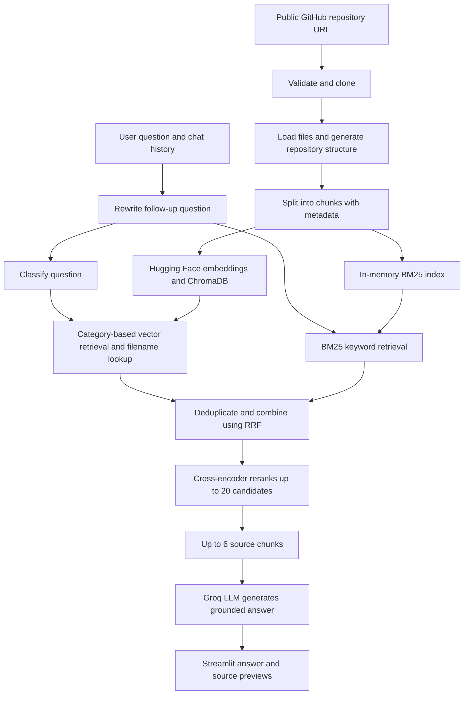

# 💻 GitHub Codebase Assistant

A conversational Retrieval-Augmented Generation (RAG) application for exploring public GitHub repositories. Enter a repository URL and ask questions about its code, documentation, configuration, and structure.

The application combines semantic vector search with BM25 keyword search, reranks retrieved evidence, and uses a Groq-hosted language model to generate answers with file references.

Developed by **Yakkala Lakshmi Charan**, a student at RGUKT Nuzvid.

## Features

- Public GitHub repository cloning with URL and repository-size validation.
- Source code, documentation, configuration, and repository-structure indexing.
- Separate code and documentation chunking, with Python decorator-aware boundaries.
- Hugging Face embeddings and persistent ChromaDB vector storage.
- BM25 keyword search over code chunks and file paths.
- Identifier matching for full names, `snake_case`, and `camelCase` parts.
- Conversational question rewriting and LLM-based query routing.
- Reciprocal rank fusion (RRF) of vector and keyword results.
- Cross-encoder reranking and duplicate evidence removal.
- Grounding instructions that require supporting evidence and file citations.
- Streamlit chat with rewritten questions, categories, and retrieved source previews.
- Separate repository and vector-store paths for each browser session.
- Standalone router, correctness, and RAGAS evaluations.

## Architecture



### Retrieval workflow

1. **Index:** Read supported files, attach metadata, and split content into chunks. Store embeddings in ChromaDB and build a repository-specific BM25 index in memory.
2. **Understand the question:** Rewrite follow-ups when needed and classify the question as overview, architecture, implementation, testing, configuration, dependency, license, or general.
3. **Retrieve:** Use category-specific vector retrieval and exact filename lookup. BM25 independently retrieves up to eight keyword matches across the indexed repository.
4. **Combine:** RRF combines ranked lists without comparing incompatible raw scores. Duplicate content from the same source is merged, while explicitly named file evidence is preserved within the candidate budget.
5. **Rerank:** A cross-encoder scores at most 20 candidates and selects up to six chunks, with reserved slots for filename matches.
6. **Answer:** The LLM receives the selected evidence and instructions to cite files, avoid unsupported claims, and identify missing information.

BM25 adds local indexing, memory, and search work, with no additional model API calls. It is rebuilt when an existing Chroma store is loaded. Quality and latency improvements must be measured rather than assumed.

## Tech stack

| Component | Technology |
|---|---|
| Language | Python |
| Interface | Streamlit |
| RAG orchestration | LangChain |
| LLM provider | Groq |
| Embeddings | `sentence-transformers/all-MiniLM-L6-v2` |
| Vector database | ChromaDB |
| Keyword retrieval | Local BM25 implementation |
| Rank fusion | Reciprocal rank fusion |
| Reranker | `cross-encoder/ms-marco-MiniLM-L6-v2` |
| Evaluation | RAGAS, labeled question sets, LLM-based correctness scoring |

## Getting started

### 1. Install dependencies

Use Python 3.11 and Git. From the project root, create a virtual environment if you do not already have one:

```bash
python3.11 -m venv venv
source venv/bin/activate
python -m pip install -r requirements.txt
```

If you already use a Conda environment, activate it and install the requirements there instead of recreating it.

### 2. Configure Groq

Create a `.env` file in the project root:

```dotenv
GROQ_API_KEY=your_groq_api_key
GROQ_MODEL=openai/gpt-oss-120b
GROQ_JUDGE_MODEL=openai/gpt-oss-20b
GROQ_JUDGE_MAX_TOKENS=8192
```

Use model IDs available to your Groq account. The GPT-OSS pair above was used for the latest completed evaluation.

| Variable | Purpose | Default when omitted |
|---|---|---|
| `GROQ_API_KEY` | Groq authentication | Required for evaluations; app provides a sidebar fallback |
| `GROQ_MODEL` | Answer generation, routing, rewriting, and correctness-evaluation judge | `llama-3.3-70b-versatile` |
| `GROQ_JUDGE_MODEL` | RAGAS judge | `llama-3.1-8b-instant` |
| `GROQ_JUDGE_MAX_TOKENS` | Output-token ceiling per RAGAS judge request during a full run | `8192` |

The token ceiling does not increase your provider quota. Keep `.env` and API keys out of version control. Restart the app after changing model settings.

### 3. Run the app

```bash
python -m streamlit run app.py
```

Using `python -m streamlit` also avoids a stale launcher path when the environment has been moved.

1. Enter a public repository URL such as `https://github.com/pallets/flask`.
2. Click **Process Repository**.
3. Ask a question after indexing finishes.
4. Expand **Source Code Chunks Used** to inspect the retrieved evidence.

The first run downloads embedding and reranking model weights. Reprocess the repository after restarting the app to use updated indexing logic.

### Example questions

- What problem does this project solve?
- Explain the folder structure.
- How does `create_vector_store` work?
- Where is authentication implemented?
- Which environment variables configure this project?
- What tests cover this feature?

## Supported files and session controls

Supported extensions: `.py`, `.js`, `.jsx`, `.ts`, `.tsx`, `.java`, `.html`, `.css`, `.md`, `.json`, `.yml`, `.yaml`, `.toml`, `.txt`, and `.rst`.

The loader skips common generated and dependency directories such as `.git`, `node_modules`, `venv`, `.venv`, `__pycache__`, `build`, and `dist`. Repository size is checked before cloning, with a configured limit of approximately 150 MB.

**Clear Chat** removes conversation history. **Reset Session** clears the session's repository, vector store, and chat state. Chat requests have a per-session limit of 20 questions per 10 minutes; this is separate from Groq's API limits.

## Project structure

```text
github-codebase-assistant/
├── app.py
├── requirements.txt
├── README.md
├── utils/
│   ├── repo_loader.py
│   ├── code_splitter.py
│   ├── vector_store.py
│   ├── bm25_retriever.py
│   ├── question_rewriter.py
│   ├── query_router.py
│   ├── multi_retriever.py
│   ├── reranker.py
│   └── rag_chain.py
├── tests/
│   └── test_bm25_retriever.py
├── eval/
│   ├── golden_router_questions.py
│   ├── golden_correctness_questions.py
│   ├── evaluate_router.py
│   ├── evaluate_correctness.py
│   ├── evaluate_ragas.py
│   ├── router_eval_results.csv
│   ├── correctness_eval_results.csv
│   └── ragas_eval_results.csv
├── repos/                       # Generated repository clones
└── chroma_db/                   # Generated vector stores
```

## Tests

```bash
python -m unittest discover -s tests -v
```

The BM25 tests cover identifier matching, empty and unmatched queries, index caching, repository isolation, metadata isolation, rank fusion, and preservation of filename matches. They run locally without Groq calls. They verify functionality rather than answer quality.

## Evaluation

Evaluation scripts are separate from the live chatbot. They use Groq API calls and consume quota.

### Router and answer correctness

```bash
python -m eval.evaluate_router
python -m eval.evaluate_correctness
```

The router evaluation checks predicted categories against labeled questions. The correctness evaluation checks generated answers against expected key facts. Results are saved under `eval/`.

### RAGAS

```bash
python -m eval.evaluate_ragas
```

The script indexes the configured evaluation repository, generates answers for 12 questions, and evaluates:

| Metric | What it measures |
|---|---|
| Context Precision | Whether retrieved chunks are relevant and ranked appropriately |
| Faithfulness | Whether answer claims are supported by retrieved evidence |
| Response Relevancy | Whether answers address the questions |

The summary reports average scores and how many questions were scored. Failed scores are excluded from averages and flagged as incomplete. A full run overwrites `eval/ragas_eval_results.csv`; preserve a copy before comparisons.

### Retry missing faithfulness scores

```bash
python -m eval.evaluate_ragas --retry-missing-faithfulness
```

This reuses saved questions, answers, and contexts, preserves successful scores, and backs up the CSV before writing recovered scores. It does not regenerate answers or reindex the repository. Use the same judge model as the original run.

The retry defaults to a 16,384-token ceiling, independently of the full-run setting. Override it with:

```bash
python -m eval.evaluate_ragas --retry-missing-faithfulness --retry-max-tokens 16384
```

If the API quota is exhausted, wait until requests are allowed again and retry. General checkpointing and resumption of every evaluation stage are not implemented.

### Recorded baseline before BM25

The latest completed evaluation before BM25 was added used `openai/gpt-oss-120b` for the pipeline and `openai/gpt-oss-20b` as the judge:

| Metric | Average | Coverage |
|---|---:|---:|
| Context Precision | 0.715 | 12/12 |
| Faithfulness | 0.896 | 12/12 |
| Response Relevancy | 0.721 | 12/12 |

These are scores on a small question set, not overall accuracy percentages. One faithfulness score was recovered using the retry command. **These results do not measure the new BM25 pipeline.** Future full runs use hybrid retrieval automatically. Compare changes using the same models, judge settings, questions, and repository revision. The evaluation does not currently measure chatbot response latency.

## Limitations and future work

- Private repositories are not supported.
- Retrieval and grounding instructions do not guarantee correct or complete answers.
- Long definitions may still span chunks; chunking is not a full syntax-tree analysis.
- Model availability and API quotas depend on the configured provider account.
- Planned improvements include hybrid-search tuning, parent-child retrieval, resumable evaluation across all metrics, and response-latency measurement.

## Author

**Lakshmi Charan Yakkala** — RGUKT Nuzvid

- [GitHub](https://github.com/lakshmicharan18)
- [LinkedIn](https://www.linkedin.com/in/charan-yakkala-95bbb8318/)

## License

This project is intended for educational and learning purposes. That statement does not itself grant an open-source license; consult any license file in the repository for applicable terms.
